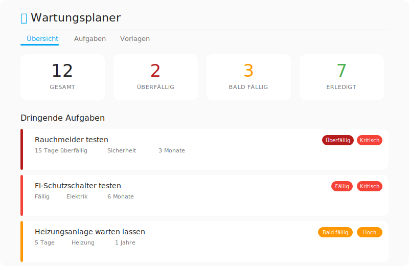
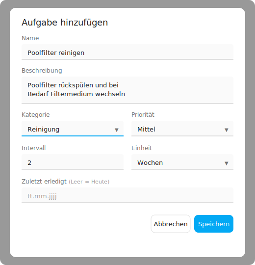
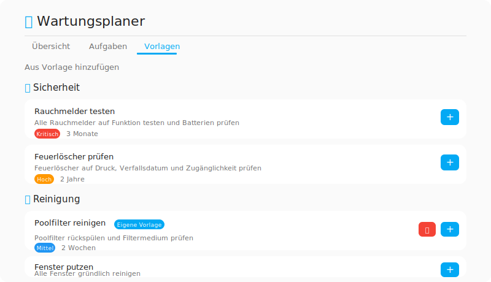
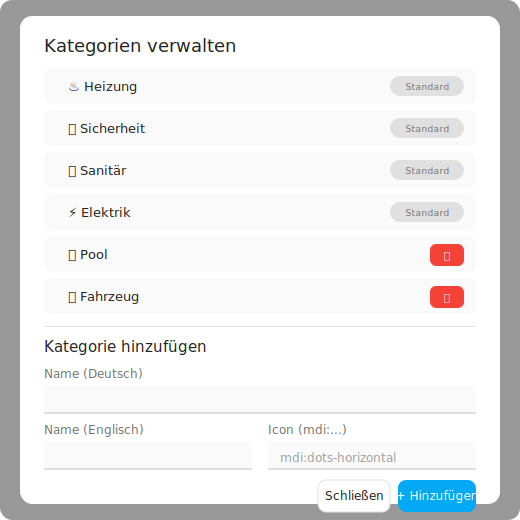
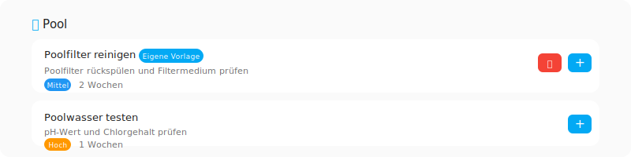
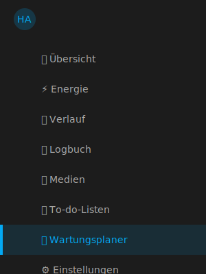

# Wartungsplaner - HACS Integration für Home Assistant

[](https://github.com/hacs/integration)
[](https://github.com/philippauer/ha-wartungsplaner/releases)
[](LICENSE)

Eine umfassende HACS Custom Integration zur Planung und Verwaltung von Haushaltswartungsaufgaben in Home Assistant.



## Features

- **Aufgabenverwaltung**: Erstellen, bearbeiten, erledigen und löschen von Wartungsaufgaben
- **Vordefinierte Vorlagen**: ~30 deutsche Aufgabenvorlagen für typische Haushaltswartung
- **Eigene Vorlagen**: Aufgaben als wiederverwendbare Vorlagen speichern
- **Eigene Kategorien**: Benutzerdefinierte Kategorien mit Icon und mehrsprachigem Namen anlegen
- **Sidebar-Panel**: Eigenes Dashboard mit Übersicht, Aufgabenliste und Vorlagen
- **Sensoren**: Pro Aufgabe ein Sensor (Tage bis fällig) und Binary Sensor (fällig ja/nein)
- **Kalender**: Integration in den Home Assistant Kalender mit Fälligkeitsterminen
- **Events**: Automatische Events bei Statusübergängen (`wartungsplaner_task_due`, `wartungsplaner_task_overdue`)
- **Services**: 5 Services für Automationen (complete, add, update, delete, snooze)
- **Zweisprachig**: Vollständig in Deutsch und Englisch verfügbar

## Screenshots

| Übersicht | Aufgabenliste |
|:-:|:-:|
|  |  |

| Aufgabe hinzufügen | Vorlagen |
|:-:|:-:|
|  |  |

| Kategorien verwalten | Eigene Vorlagen |
|:-:|:-:|
|  |  |

## Installation

### HACS (empfohlen)

1. Öffne HACS in Home Assistant
2. Klicke auf "Integrationen"
3. Klicke auf die drei Punkte oben rechts und wähle "Benutzerdefinierte Repositories"
4. Füge `https://github.com/philippauer/ha-wartungsplaner` hinzu und wähle "Integration" als Kategorie
5. Suche nach "Wartungsplaner" und installiere es
6. Starte Home Assistant neu

### Manuelle Installation

1. Lade den `custom_components/wartungsplaner/` Ordner herunter
2. Kopiere ihn in dein Home Assistant `custom_components/` Verzeichnis
3. Starte Home Assistant neu

## Konfiguration

1. Gehe zu **Einstellungen** > **Geräte & Dienste** > **Integration hinzufügen**
2. Suche nach "Wartungsplaner"
3. Konfiguriere die Optionen:
   - **Tage vor Fälligkeit**: Ab wann eine Aufgabe als "Bald fällig" angezeigt wird (Standard: 7 Tage)
   - **Events aktivieren**: Statusänderungs-Events für Automationen

## Verwendung

### Sidebar-Panel

Nach der Installation erscheint "Wartungsplaner" in der Seitenleiste mit drei Tabs:

- **Übersicht**: Statistik-Karten und dringende Aufgaben
- **Aufgaben**: Filterbare Aufgabenliste mit Such- und Filterfunktion
- **Vorlagen**: Vordefinierte und eigene Aufgabenvorlagen zum schnellen Hinzufügen



### Aufgaben erstellen

Beim Erstellen oder Bearbeiten einer Aufgabe stehen folgende Felder zur Verfügung:

| Feld | Beschreibung |
|------|-------------|
| Name | Name der Wartungsaufgabe |
| Beschreibung | Optionale Details zur Aufgabe |
| Kategorie | Eingebaute oder eigene Kategorie |
| Priorität | Niedrig, Mittel, Hoch, Kritisch |
| Intervall | Wiederholungsintervall (Tage/Wochen/Monate/Jahre) |
| Zuletzt erledigt | Datum der letzten Erledigung (leer = heute) |

### Eigene Kategorien

Über den Zahnrad-Button in der Toolbar lassen sich eigene Kategorien anlegen:

- Deutscher und englischer Name
- MDI-Icon (z.B. `mdi:pool`, `mdi:car`)
- Kategorien mit zugewiesenen Aufgaben können nicht gelöscht werden

### Eigene Vorlagen

Jede Aufgabe kann über das Disketten-Icon als Vorlage gespeichert werden. Eigene Vorlagen erscheinen im Vorlagen-Tab und können dort wieder gelöscht werden.

### Sensoren

Für jede Aufgabe werden automatisch erstellt:
- **Sensor** (`sensor.wartungsplaner_*`): Zeigt Tage bis zur Fälligkeit
- **Binary Sensor** (`binary_sensor.wartungsplaner_*`): ON wenn fällig oder überfällig

### Kalender

Der Kalender `calendar.wartungsplaner` zeigt alle Fälligkeitstermine als Ganztags-Events.

## Services

### `wartungsplaner.complete_task`
Markiert eine Aufgabe als erledigt.
```yaml
service: wartungsplaner.complete_task
data:
  task_id: "uuid-der-aufgabe"
  notes: "Optionale Notizen"
```

### `wartungsplaner.add_task`
Fügt eine neue Aufgabe hinzu.
```yaml
service: wartungsplaner.add_task
data:
  name: "Heizungsfilter wechseln"
  description: "Filter der Heizungsanlage austauschen"
  category: "heating"
  priority: "high"
  interval_value: 6
  interval_unit: "months"
```

### `wartungsplaner.update_task`
Aktualisiert eine bestehende Aufgabe.
```yaml
service: wartungsplaner.update_task
data:
  task_id: "uuid-der-aufgabe"
  priority: "critical"
  last_completed: "2026-01-15"
```

### `wartungsplaner.delete_task`
Löscht eine Aufgabe.
```yaml
service: wartungsplaner.delete_task
data:
  task_id: "uuid-der-aufgabe"
```

### `wartungsplaner.snooze_task`
Verschiebt die Fälligkeit einer Aufgabe.
```yaml
service: wartungsplaner.snooze_task
data:
  task_id: "uuid-der-aufgabe"
  until_date: "2026-03-15"
```

## Kategorien

### Eingebaute Kategorien

| Kategorie | Schlüssel | Icon |
|-----------|-----------|------|
| Heizung | `heating` | mdi:radiator |
| Sicherheit | `safety` | mdi:shield-check |
| Sanitär | `plumbing` | mdi:water-pump |
| Geräte | `appliances` | mdi:washing-machine |
| Außen | `exterior` | mdi:home-roof |
| Innen | `interior` | mdi:sofa |
| Elektrik | `electrical` | mdi:flash |
| Garten | `garden` | mdi:flower |
| Reinigung | `cleaning` | mdi:broom |
| Sonstiges | `other` | mdi:dots-horizontal |

Eigene Kategorien können über das Panel hinzugefügt werden und unterstützen alle [MDI-Icons](https://pictogrammers.com/library/mdi/).

## Beispiel-Automationen

### Benachrichtigung bei überfälligen Aufgaben

```yaml
automation:
  - alias: "Wartungsplaner - Überfällige Aufgabe"
    trigger:
      - platform: event
        event_type: wartungsplaner_task_overdue
    action:
      - service: notify.mobile_app
        data:
          title: "Wartungsaufgabe überfällig!"
          message: "{{ trigger.event.data.task_name }} ist überfällig."
          data:
            tag: "wartungsplaner_{{ trigger.event.data.task_id }}"
            importance: high
```

### Tägliche Zusammenfassung

```yaml
automation:
  - alias: "Wartungsplaner - Tägliche Zusammenfassung"
    trigger:
      - platform: time
        at: "08:00:00"
    condition:
      - condition: template
        value_template: >
          {{ states.binary_sensor
             | selectattr('entity_id', 'match', 'binary_sensor.wartungsplaner_')
             | selectattr('state', 'eq', 'on')
             | list | count > 0 }}
    action:
      - service: notify.mobile_app
        data:
          title: "Wartungsplaner"
          message: >
            {{ states.binary_sensor
               | selectattr('entity_id', 'match', 'binary_sensor.wartungsplaner_')
               | selectattr('state', 'eq', 'on')
               | list | count }} Aufgabe(n) fällig oder überfällig.
```

## Lizenz

MIT License - siehe [LICENSE](LICENSE) Datei.
